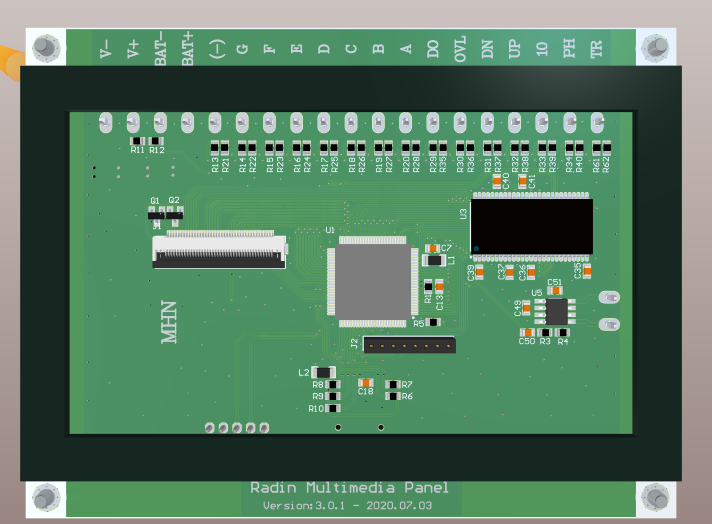
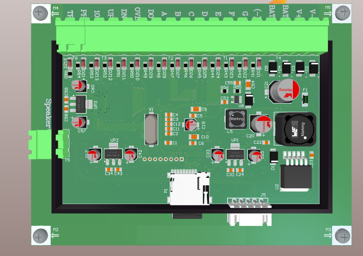
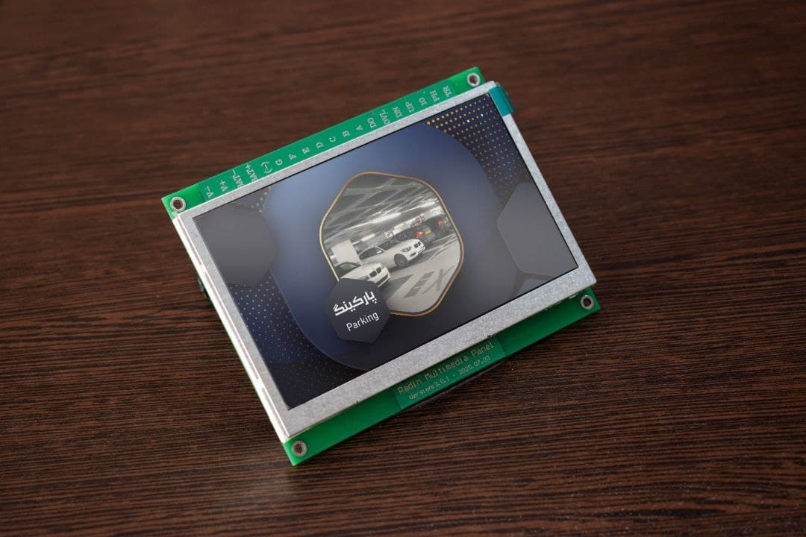
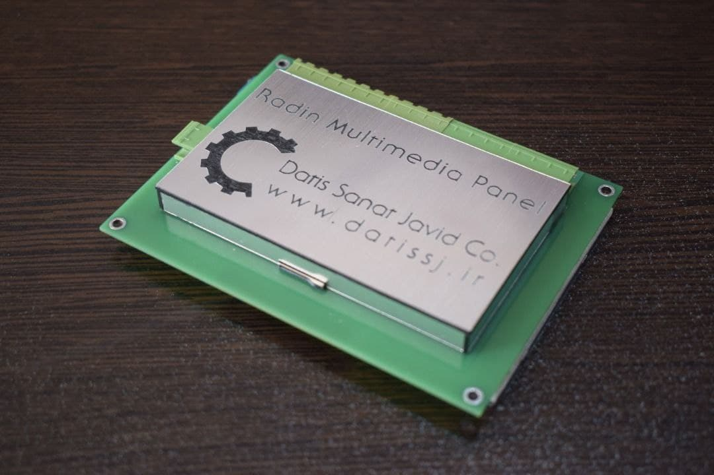
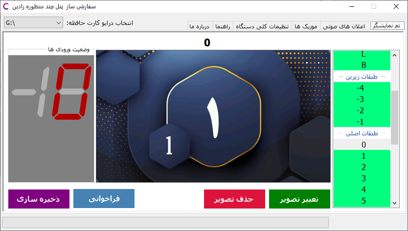
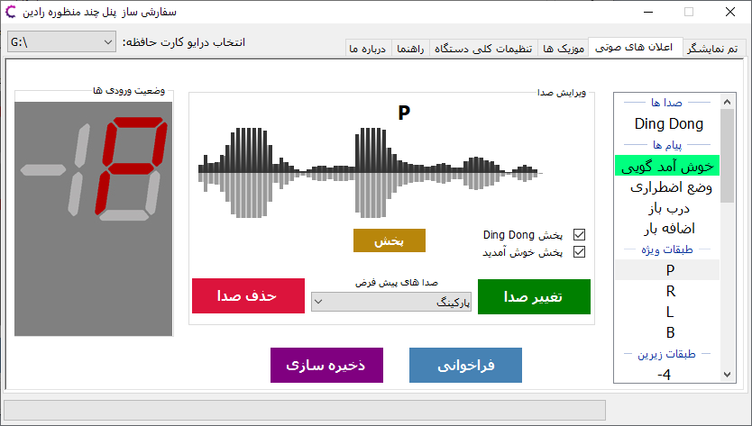
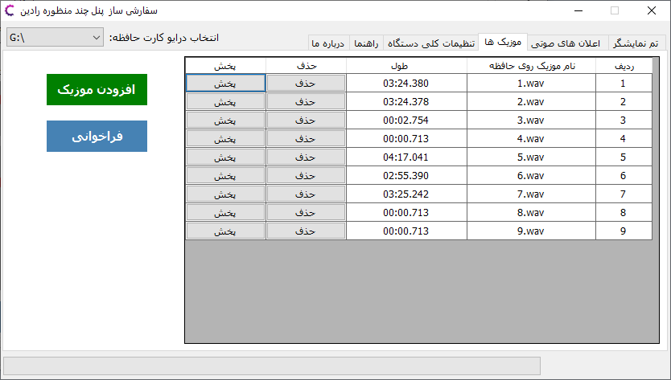
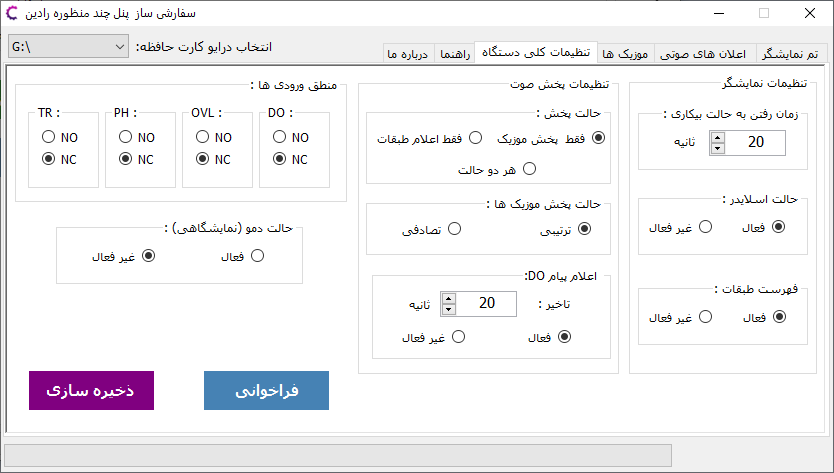

# Elevator Multimedia Panel

This project is a comprehensive multimedia display system for elevators. It features an STM32-based main controller driving an LCD panel to show floor number, direction, status messages, and multimedia content. It includes a PC application for configuration and an Arduino-based simulator for testing.

## Project Structure

The repository is organized as follows:

- **MCU Code/**: Firmware for the main display controller.
    - **EL_LCD_3.0.1/**: STM32CubeIDE project (likely STM32F4 series) handling graphics rendering, SD card reading for media, and CAN/RS485 communication with the elevator controller.

- **Configuration Application/**:
    - **App1.sln**: A Windows application (C#/.NET) allowing users to customize the panel's settings (e.g., floor images, messages, audio) and save them to an SD card.

- **Arduino Simulator/**:
    - **all.ino**: Arduino sketch used to simulate elevator signals (floor codes, movement) for bench testing the panel without a real elevator installation.

- **PCB/**: Hardware design files for the custom circuit board.
- **Mechanical Design/**: Enclosure or mounting frame designs.
- **Media/**: Visual resources and documentation images.

## Features

- **Multimedia Display**: Shows floor numbers, arrows, and custom images/videos.
- **Audio Announcements**: Plays floor announcements or background music (uses NAudio in the config app, implying WAV/MP3 support).
- **Configurable**: Fully customizable via the PC application and SD card updates.
- **Simulation**: Includes tools to simulate elevator behavior for easy debugging.

## Usage

1. **Firmware**:
   - Open `MCU Code/EL_LCD_3.0.1/` in STM32CubeIDE.
   - Compile and flash to the main controller board.

2. **Configuration**:
   - Run the PC application (`App1.sln`).
   - Create a configuration profile (select images/sounds for each floor).
   - Export the configuration to an SD card.
   - Insert the SD card into the panel.

3. **Testing**:
   - Connect the Arduino Simulator to the panel's input port.
   - Run `all.ino` on an Arduino board to cycle through floors and states.

## Gallery

